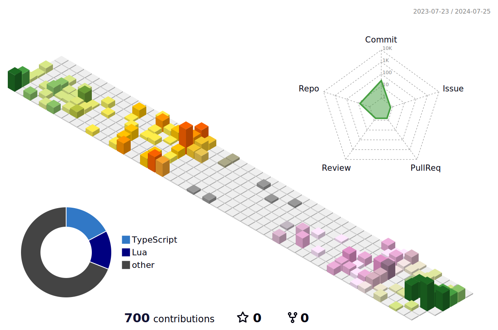

# Hi, there. I'm Taiki Ishikawa 👋
Welcome to my GitHub profile!

## My favorite language and tools
### Language

### Frameworks & Library

### Database

### Cloud

### Virtualization

### Dev Tools

## Currently learning

